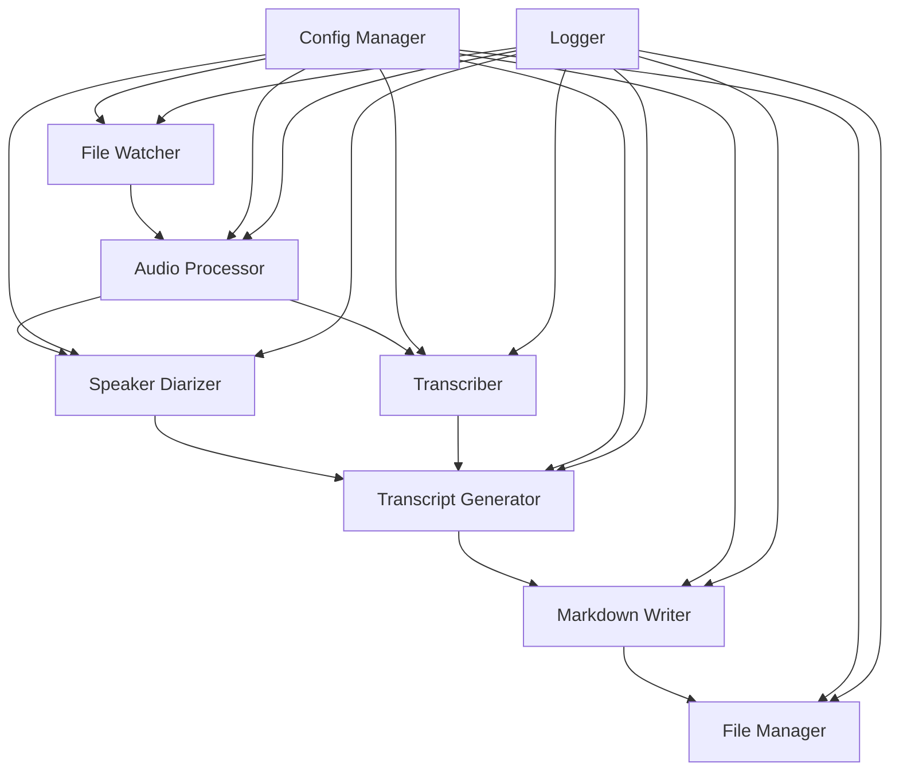
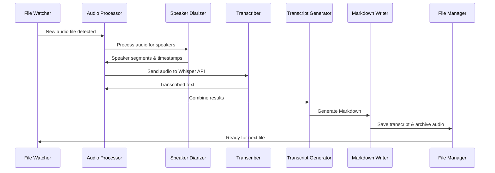

# Obsidian Scribe Architecture

## Overview

Obsidian Scribe is a Python application designed to complement the Obsidian Whisper plugin by providing advanced post-processing capabilities. While the Whisper plugin handles audio recording, Obsidian Scribe adds speaker diarization, smart file chunking for large files, and enhanced Markdown formatting. The system monitors the Audio folder where Whisper saves recordings, processes new audio files, and creates structured transcripts with speaker identification and timestamps.

### Complementary Workflow
1. **Obsidian Whisper Plugin**: Handles audio recording via VoiceMeeter
2. **Obsidian Scribe**: Provides advanced processing and transcription

## Key Features

- **Automatic File Monitoring**: Watches for new .wav and .mp3 files in the Audio folder
- **Speaker Diarization**: Identifies and separates different speakers using pyannote.audio
- **Transcription**: Converts speech to text using OpenAI-compatible Whisper API
- **Markdown Generation**: Creates Obsidian-optimized Markdown files with YAML front matter
- **File Management**: Archives processed audio files to prevent reprocessing
- **Configuration**: Flexible YAML-based configuration
- **Robust Error Handling**: Comprehensive logging and error recovery

## System Architecture

### High-Level Components



### Component Details

#### 1. File Watcher
- **Purpose**: Monitor the Audio folder for new audio files
- **Technology**: `watchdog` library for cross-platform file system monitoring
- **Responsibilities**:
  - Detect new .wav and .mp3 files
  - Filter out temporary and partial files
  - Queue files for processing
  - Handle file system events efficiently

#### 2. Audio Processor
- **Purpose**: Orchestrate the processing pipeline
- **Responsibilities**:
  - Validate audio files
  - Convert audio to required format if needed
  - Coordinate diarization and transcription
  - Handle processing errors and retries

#### 3. Speaker Diarizer
- **Purpose**: Identify different speakers in audio
- **Technology**: `pyannote.audio` with pre-trained models
- **Responsibilities**:
  - Segment audio by speaker
  - Generate speaker timestamps
  - Handle multi-speaker scenarios (5+ speakers)
  - Provide speaker confidence scores

#### 4. Transcriber
- **Purpose**: Convert speech to text
- **Technology**: OpenAI-compatible Whisper API
- **Configuration**:
  - Custom endpoint: `https://api.rdsec.trendmicro.com/prod/aiendpoint/v1/audio/transcriptions`
  - Model: `whisper-1`
  - File size limit: 25MB per request
- **Responsibilities**:
  - Split large audio files (>25MB) into chunks
  - Send audio segments to API
  - Handle API authentication
  - Manage rate limiting and retries
  - Concatenate transcriptions from multiple chunks
  - Return timestamped transcriptions

##### Audio Chunking Strategy
- **Smart Splitting**: Detect silence points to avoid cutting words
- **Fallback**: Time-based splitting when silence detection fails
- **Chunk Size**: Target 20-24MB per chunk (safety margin)
- **Duration**: Optimal 5-10 minutes per chunk

#### 5. Transcript Generator
- **Purpose**: Combine diarization and transcription results
- **Responsibilities**:
  - Align speaker segments with transcribed text
  - Generate timestamp markers
  - Format speaker sections
  - Create structured transcript data

#### 6. Markdown Writer
- **Purpose**: Generate Obsidian-compatible Markdown files
- **Responsibilities**:
  - Create YAML front matter with metadata
  - Format transcript with speaker headings
  - Include timestamps and speaker labels
  - Generate backlinks to audio files
  - Save to appropriate location

#### 7. File Manager
- **Purpose**: Handle file organization and archiving
- **Responsibilities**:
  - Move processed audio files to archive
  - Maintain processing history
  - Clean up temporary files
  - Manage storage space

#### 8. Config Manager
- **Purpose**: Centralize configuration management
- **Technology**: `PyYAML` for YAML parsing
- **Responsibilities**:
  - Load and validate configuration
  - Provide configuration to all components
  - Support environment variable overrides
  - Handle configuration updates

#### 9. Logger
- **Purpose**: Provide comprehensive logging
- **Technology**: Python `logging` module with rotating file handlers
- **Responsibilities**:
  - Log all major operations
  - Track processing metrics
  - Record errors with context
  - Support different log levels

## Data Flow



## Project Structure

```
obsidian-scribe/
├── src/
│   ├── __init__.py
│   ├── main.py                 # Application entry point
│   ├── config/
│   │   ├── __init__.py
│   │   ├── manager.py          # Configuration management
│   │   └── schema.py           # Configuration validation
│   ├── watcher/
│   │   ├── __init__.py
│   │   ├── file_watcher.py     # File system monitoring
│   │   └── event_handler.py    # File event processing
│   ├── audio/
│   │   ├── __init__.py
│   │   ├── processor.py        # Audio processing orchestration
│   │   ├── diarizer.py         # Speaker diarization
│   │   └── transcriber.py      # Whisper API integration
│   ├── transcript/
│   │   ├── __init__.py
│   │   ├── generator.py        # Transcript generation
│   │   └── markdown_writer.py  # Markdown formatting
│   ├── storage/
│   │   ├── __init__.py
│   │   ├── file_manager.py     # File operations
│   │   └── archive.py          # Archive management
│   └── utils/
│       ├── __init__.py
│       ├── logger.py           # Logging utilities
│       └── exceptions.py       # Custom exceptions
├── config/
│   └── config.yaml             # Default configuration
├── tests/
│   ├── __init__.py
│   ├── test_watcher.py
│   ├── test_audio.py
│   ├── test_transcript.py
│   └── test_storage.py
├── docs/
│   ├── setup.md               # Setup instructions
│   ├── configuration.md       # Configuration guide
│   └── api.md                 # API documentation
├── requirements.txt           # Python dependencies
├── setup.py                   # Package setup
├── README.md                  # Project overview
└── .gitignore                # Git ignore rules
```

## Configuration Schema

```yaml
# config.yaml
obsidian_scribe:
  # Paths configuration
  paths:
    audio_folder: "./Audio"              # Folder to monitor for audio files
    transcript_folder: "./Transcripts"   # Output folder for transcripts
    archive_folder: "./Audio/Archive"    # Archive for processed files
    temp_folder: "./temp"               # Temporary file storage

  # File watching configuration
  watcher:
    file_extensions: [".wav", ".mp3"]   # Supported audio formats
    poll_interval: 1.0                  # Seconds between folder checks
    ignore_patterns: [".*", "~*"]       # Patterns to ignore

  # Audio processing configuration
  audio:
    max_file_size_mb: 500               # Maximum file size to process
    sample_rate: 16000                  # Target sample rate for processing
    
  # Speaker diarization configuration
  diarization:
    model: "pyannote/speaker-diarization"  # Pyannote model to use
    min_speakers: 1                     # Minimum expected speakers
    max_speakers: 10                    # Maximum expected speakers
    min_segment_duration: 0.5           # Minimum segment duration in seconds
    
  # Transcription configuration
  transcription:
    api_endpoint: "https://api.rdsec.trendmicro.com/prod/aiendpoint/v1/audio/transcriptions"
    model: "whisper-1"
    api_key_env: "OPENAI_API_KEY"       # Environment variable for API key
    language: "en"                      # Default language
    temperature: 0.0                    # Model temperature
    timeout: 300                        # API timeout in seconds
    max_retries: 3                      # Maximum retry attempts
    
  # Markdown generation configuration
  markdown:
    include_timestamps: true            # Include timestamps in transcript
    timestamp_format: "[%H:%M:%S]"      # Timestamp format
    speaker_emoji: "🗣"                 # Emoji for speaker headings
    default_title: "Audio Transcript"   # Default title if none provided
    tags: ["transcript", "audio"]       # Default tags
    
  # Logging configuration
  logging:
    level: "INFO"                       # Log level (DEBUG, INFO, WARNING, ERROR)
    file: "obsidian_scribe.log"         # Log file name
    max_size_mb: 10                     # Maximum log file size
    backup_count: 5                     # Number of backup logs to keep
    
  # Processing configuration
  processing:
    concurrent_files: 1                 # Number of files to process simultaneously
    retry_failed: true                  # Retry failed files
    retry_delay: 60                     # Seconds to wait before retry
```

## Error Handling Strategy

### Error Categories

1. **File System Errors**
   - Permission denied
   - File not found
   - Disk space issues
   - Solution: Log error, skip file, notify user

2. **Audio Processing Errors**
   - Corrupted audio files
   - Unsupported formats
   - Solution: Move to failed folder, log details

3. **API Errors**
   - Authentication failures
   - Rate limiting
   - Network issues
   - Solution: Exponential backoff, queue for retry

4. **Diarization Errors**
   - Model loading failures
   - Insufficient memory
   - Solution: Fallback to simple transcription

### Recovery Mechanisms

- **Graceful Degradation**: Continue processing other files if one fails
- **Automatic Retries**: Configurable retry logic with exponential backoff
- **State Persistence**: Save processing state to resume after crashes
- **Health Checks**: Periodic validation of dependencies and resources

## Security Considerations

1. **API Key Management**
   - Store API keys in environment variables
   - Never commit keys to version control
   - Support key rotation

2. **File Access**
   - Validate file paths to prevent directory traversal
   - Check file permissions before processing
   - Sanitize file names for output

3. **Data Privacy**
   - Process files locally when possible
   - Clear temporary files after processing
   - Log sanitization to remove sensitive data

## Performance Optimization

1. **Efficient File Watching**
   - Use OS-native file system events
   - Batch process multiple files
   - Implement debouncing for rapid changes

2. **Audio Processing**
   - Stream large files instead of loading to memory
   - Cache diarization models
   - Reuse API connections

3. **Concurrent Processing**
   - Process multiple files in parallel (configurable)
   - Implement queue management
   - Monitor resource usage

## Integration with Obsidian Whisper Plugin

Obsidian Scribe is designed as a complementary tool to the Obsidian Whisper plugin, not a replacement.

### Recommended Whisper Plugin Settings
```yaml
# Obsidian Whisper Plugin Configuration
Save recording: ON
Recordings folder: "Audio/"
Save transcription: OFF  # Let Obsidian Scribe handle this
```

### Why Keep Both Tools?
1. **Whisper Plugin**:
   - Proven recording functionality
   - Quick transcription for simple notes
   - Integrated with Obsidian UI
   
2. **Obsidian Scribe**:
   - Speaker diarization for multi-person recordings
   - Handles files >25MB with smart chunking
   - Enhanced formatting with speaker sections
   - Batch processing capabilities

### Recording Workflow
1. **VoiceMeeter** mixes microphone + Teams/system audio (see [VOICEMEETER_SETUP.md](VOICEMEETER_SETUP.md))
2. **Obsidian Whisper Plugin** records the mixed stream to Audio folder
3. **Obsidian Scribe** automatically:
   - Detects new recordings
   - Performs speaker diarization
   - Handles large file chunking
   - Creates enhanced transcripts
   - Archives processed files

## Future Enhancements

1. **Web Interface**
   - Real-time processing status
   - Configuration management UI
   - Transcript preview and editing

2. **Advanced Features**
   - Speaker identification (name mapping)
   - Automatic summarization
   - Sentiment analysis
   - Topic extraction

3. **Integration Options**
   - Obsidian plugin development
   - Webhook notifications
   - Cloud storage support
   - Multi-language support

## Dependencies

### Core Dependencies
- `watchdog`: File system monitoring
- `pyannote.audio`: Speaker diarization
- `openai`: Whisper API client (configured for custom endpoint)
- `pyyaml`: Configuration management
- `pydub`: Audio file manipulation
- `numpy`: Audio processing
- `torch`: Deep learning framework (for pyannote)

### Development Dependencies
- `pytest`: Testing framework
- `black`: Code formatting
- `flake8`: Linting
- `mypy`: Type checking

## Deployment Considerations

1. **System Requirements**
   - Python 3.8+
   - 8GB RAM minimum (16GB recommended for large files)
   - GPU optional but recommended for faster diarization

2. **Installation Methods**
   - pip package
   - Docker container
   - Standalone executable (PyInstaller)

3. **Monitoring**
   - Processing metrics
   - Error rates
   - Performance statistics
   - Storage usage

This architecture provides a robust, scalable foundation for the Obsidian Scribe application, with clear separation of concerns and extensive configuration options.