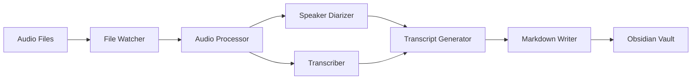

# Obsidian Scribe - Advanced Audio Processing for Obsidian

## Overview

Obsidian Scribe is a Python application designed to complement the Obsidian Whisper plugin by providing advanced audio processing capabilities. While Whisper handles recording, Obsidian Scribe adds speaker diarization, smart file chunking for large recordings, and enhanced Markdown formatting optimized for Obsidian.

### Complementary Workflow

- **Obsidian Whisper Plugin**: Records audio using VoiceMeeter mixed input
- **Obsidian Scribe**: Automatically processes recordings with advanced features

## 🚀 TL;DR - Quick Setup

**Want to get up and running in 5 minutes?**

```bash
# 1. Clone and install
git clone https://github.com/yourusername/obsidian-scribe.git
cd obsidian-scribe
pip install -e .

# 2. Setup config
cp config.example.yaml config.yaml
# Edit config.yaml - set your audio/transcript paths

# 3. Set API key
export OPENAI_API_KEY="your-api-key-here"

# 4. Optional: Enable speaker diarization
export HUGGING_FACE_TOKEN="your-hf-token-here"  # Get from https://hf.co/settings/tokens

# 5. Run it!
obsidian-scribe

# Drop audio files in your Audio folder and watch the magic happen! ✨
```

**⚡ Performance Note**: Speaker diarization takes ~2-3 hours per hour of audio (free, local processing). Use `--no-diarization` for instant transcription. Only API transcription costs money (~$0.006/minute).

**Pro tip**: Use `obsidian-scribe --debug` to see detailed progress. Files >25MB are automatically chunked.

---

## Key Features

- 🎙️ **Automatic Audio Processing**: Monitors Audio folder for new .wav/.mp3 files
- 👥 **Speaker Diarization**: Identifies and separates different speakers using pyannote.audio
- 📝 **Transcription**: Converts speech to text using OpenAI-compatible Whisper API
- 📄 **Markdown Generation**: Creates Obsidian-optimized transcripts with YAML front matter
- 📁 **File Management**: Archives processed files to prevent reprocessing
- 🔪 **Smart Audio Splitting**: Handles files >25MB with intelligent chunking
- 🎙️ **VoiceMeeter Integration**: Documented setup for multi-source audio recording
- ⚙️ **Flexible Configuration**: YAML-based configuration with environment variable support
- 🛡️ **Robust Error Handling**: Comprehensive logging and automatic retry mechanisms

## Documentation

Complete documentation is available in the `docs/` directory:

### Getting Started

- **[Installation Guide](docs/INSTALLATION.md)** - Prerequisites, setup, and troubleshooting
- **[Usage Guide](docs/USAGE.md)** - How to use Obsidian Scribe effectively
- **[Configuration Guide](docs/CONFIGURATION.md)** - All configuration options explained

### Technical Documentation

- **[API Reference](docs/API_REFERENCE.md)** - Complete API documentation for all modules
- **[Architecture Overview](docs/technical/ARCHITECTURE.md)** - System design and component interactions

### Architecture Documents

1. **[ARCHITECTURE.md](docs/technical/ARCHITECTURE.md)** - Comprehensive system architecture including:
   - High-level component design
   - Component interactions and data flow
   - Detailed component descriptions
   - Error handling strategies
   - Security considerations
   - Performance optimizations

2. **[PROJECT_STRUCTURE.md](docs/project/PROJECT_STRUCTURE.md)** - Detailed project organization including:
   - Complete directory layout
   - Module descriptions
   - File naming conventions
   - Key design patterns
   - Testing structure
   - Development workflow

3. **[TECHNICAL_DECISIONS.md](docs/technical/TECHNICAL_DECISIONS.md)** - Rationale for technology choices:
   - Library selection (pyannote.audio vs whisper-diarization)
   - API vs local model decisions
   - Architectural pattern choices
   - Performance trade-offs
   - Rejected alternatives

4. **[CONFIG_SCHEMA.md](docs/technical/CONFIG_SCHEMA.md)** - Complete configuration reference:
   - All configuration options
   - Environment variable overrides
   - Configuration profiles
   - Validation rules
   - Best practices

5. **[VOICEMEETER_SETUP.md](docs/technical/VOICEMEETER_SETUP.md)** - VoiceMeeter configuration guide:
   - Windows audio routing setup
   - Mixing microphone and Teams audio
   - Integration with Obsidian Whisper plugin
   - Troubleshooting tips

6. **[AUDIO_CHUNKING.md](docs/technical/AUDIO_CHUNKING.md)** - Audio chunking strategy:
   - Handling the 25MB API limit
   - Smart splitting with silence detection
   - Fallback strategies
   - Integration with diarization

7. **[WHISPER_INTEGRATION.md](docs/technical/WHISPER_INTEGRATION.md)** - Integration guide:
   - Configuring both tools to work together
   - Workflow scenarios
   - Best practices
   - Troubleshooting tips

## Quick Start Architecture Overview

### System Components



### Technology Stack

- **Language**: Python 3.8+
- **Speaker Diarization**: pyannote.audio
- **Transcription**: OpenAI Whisper API (custom endpoint)
- **File Monitoring**: watchdog
- **Audio Processing**: pydub
- **Configuration**: PyYAML
- **Logging**: Python logging with rotation

### Key Design Decisions

1. **Whisper API over Local Model**
   - Uses company-provided endpoint: `https://api.rdsec.trendmicro.com/prod/aiendpoint/v1/`
   - No GPU requirements
   - Consistent performance
   - 25MB file size limit handled via chunking

2. **pyannote.audio for Diarization**
   - Superior accuracy for 5+ speakers
   - Extensive configuration options
   - Active development and support
   - Essential for mixed audio streams from VoiceMeeter

3. **Event-Driven Architecture**
   - Real-time file processing
   - Decoupled components
   - Scalable design

4. **Audio Chunking Strategy**
   - Smart splitting at silence points
   - Fallback to time-based splitting
   - Maintains context with overlapping segments

### Output Format

Transcripts are generated in Obsidian-optimized Markdown:

```markdown
---
title: Meeting Recording - 2024-01-15
date: 2024-01-15
duration: 00:45:32
speakers:
  - Speaker 1
  - Speaker 2
  - Speaker 3
tags: [meeting, transcript, audio]
audio_file: "[[Audio/Meeting-2024-01-15.wav]]"
---

## 🗣 Speaker 1
[00:00:12] Welcome everyone to today's meeting.
[00:00:45] Let's start with the agenda.

## 🗣 Speaker 2
[00:01:10] Thanks for having me. I have some updates...
```

## Installation

### Prerequisites

- Python 3.8 or higher
- FFmpeg installed and in PATH
- Git (for cloning the repository)
- Hugging Face account (free) for speaker diarization

### Quick Install

```bash
# Clone the repository
git clone https://github.com/yourusername/obsidian-scribe.git
cd obsidian-scribe

# Install the package
pip install -e .

# Or use make
make install
```

### Setting Up Speaker Diarization (Optional but Recommended)

Speaker diarization identifies different speakers in your audio recordings. To enable this feature:

1. **Create a free Hugging Face account**
   - Go to <https://huggingface.co/join>
   - Sign up with your email

2. **Accept the conditions for BOTH pyannote models** (Required)
   - Visit <https://hf.co/pyannote/speaker-diarization>
     - Click "Agree and access repository"
     - You must be logged in to accept
   - Visit <https://hf.co/pyannote/segmentation>
     - Click "Agree and access repository"
     - You must be logged in to accept

3. **Create an access token**
   - Visit <https://huggingface.co/settings/tokens>
   - Click "New token"
   - Name it (e.g., "obsidian-scribe")
   - Set permission to "read"
   - Copy the generated token

4. **Configure the token** (choose one method):

   **Option A - Environment Variable (Recommended):**

   ```bash
   # Add to your .env file
   HUGGING_FACE_TOKEN=your_token_here
   ```

   **Option B - Configuration File:**

   ```yaml
   # Add to config.yaml under diarization section
   diarization:
     hf_token: "your_token_here"
   ```

> **Note:** Without a Hugging Face token, the application will still work but without speaker identification features.

### Windows Users - Important Note

On Windows, speaker diarization requires either Administrator privileges or Developer Mode enabled due to symlink creation requirements. If you encounter a "required privilege is not held" error:

**Option 1 - Run as Administrator (Easiest):**

```bash
# Right-click on Command Prompt or PowerShell
# Select "Run as Administrator"
# Then run obsidian-scribe normally
```

**Option 2 - Enable Developer Mode:**

1. Open Windows Settings
2. Go to Update & Security → For developers
3. Enable "Developer Mode"
4. Restart your terminal

**Option 3 - Continue without Speaker Diarization:**

- The application will automatically disable speaker diarization if it can't create symlinks
- All other features (transcription, formatting, etc.) will work normally
- You'll just get a single-speaker transcript

For detailed installation instructions, see [docs/INSTALLATION.md](docs/INSTALLATION.md).

## Project Structure

```
obsidian-scribe/
├── src/
│   ├── config/         # Configuration management
│   ├── watcher/        # File system monitoring
│   ├── audio/          # Audio processing & transcription
│   ├── transcript/     # Transcript generation
│   ├── storage/        # File management
│   └── utils/          # Utilities and helpers
├── docs/               # Complete documentation
├── tests/              # Test suite
├── Audio/              # Input audio files (created on first run)
├── Transcripts/        # Output transcripts (created on first run)
└── Archive/            # Processed files (created on first run)
```

## Configuration

1. Copy the example configuration:

   ```bash
   cp config.example.yaml config.yaml
   ```

2. Edit `config.yaml` with your settings:

   ```yaml
   obsidian_scribe:
     paths:
       audio_folder: "./Audio"
       transcript_folder: "./Transcripts"
       archive_folder: "./Archive"
     
     transcription:
       api_endpoint: "https://api.openai.com/v1/audio/transcriptions"
       model: "whisper-1"
       api_key_env: "OPENAI_API_KEY"
     
     diarization:
       enabled: true
       max_speakers: 10
   ```

3. Set your API key:

   ```bash
   export OPENAI_API_KEY="your-api-key-here"
   ```

For complete configuration options, see [docs/CONFIGURATION.md](docs/CONFIGURATION.md).

## Usage

### Basic Usage

```bash
# Run with default config
obsidian-scribe

# Run with custom config
obsidian-scribe --config /path/to/config.yaml

# Run in debug mode
obsidian-scribe --debug
```

### As a Python Module

```python
from src.config.manager import ConfigManager
from src.watcher.file_watcher import FileWatcher
from src.audio.processor import AudioProcessor

# Initialize components
config = ConfigManager.get_config()
processor = AudioProcessor(config)
watcher = FileWatcher(config['paths']['audio_folder'], processor, config)

# Start processing
watcher.start()
```

For more usage examples, see [docs/USAGE.md](docs/USAGE.md).

## Complete Recording & Processing Workflow

### 1. One-Time Setup

- **Install VoiceMeeter** - Mix multiple audio sources (see [VOICEMEETER_SETUP.md](VOICEMEETER_SETUP.md))
- **Configure Obsidian Whisper Plugin**:

  ```yaml
  Save recording: ON
  Recordings folder: "Audio/"
  Save transcription: OFF  # Let Obsidian Scribe handle this
  ```

- **Install & Configure Obsidian Scribe** - Monitor Audio folder

### 2. Recording Process

1. **Start VoiceMeeter** - Ensures audio mixing is active
2. **Use Obsidian Whisper Plugin** - Record meeting/conversation
3. **Audio saved to vault** - Whisper saves to Audio folder

### 3. Automatic Processing

Obsidian Scribe automatically:

- Detects new audio files
- Splits large files if >25MB
- Performs speaker diarization
- Transcribes via company Whisper API
- Generates enhanced Markdown
- Archives processed audio

### Why Use Both Tools?

- **Whisper Plugin**: Proven recording interface within Obsidian
- **Obsidian Scribe**: Adds capabilities Whisper doesn't have:
  - Multi-speaker identification
  - Large file handling
  - Enhanced formatting
  - Batch processing

## Development

### Setup Development Environment

```bash
# Install development dependencies
make dev

# Run tests
make test

# Run linting
make lint

# Build package
make build
```

### Contributing

See [docs/CONTRIBUTING.md](docs/CONTRIBUTING.md) for guidelines on contributing to this project.

## Troubleshooting

Common issues and solutions are documented in [docs/TROUBLESHOOTING.md](docs/TROUBLESHOOTING.md).

## Recent Updates

- ✅ Complete project restructuring with modular architecture
- ✅ Comprehensive documentation in `docs/` directory
- ✅ Fixed all import and dependency issues
- ✅ Added `.gitignore` for sensitive files and large audio files
- ✅ Modern Python packaging with `setup.py`, `setup.cfg`, and `pyproject.toml`
- ✅ Development tools with `Makefile`

See [CHANGELOG.md](CHANGELOG.md) for detailed version history.

## License

This project is licensed under the MIT License - see the [LICENSE](LICENSE) file for details.

## Acknowledgments

- [Obsidian Whisper Plugin](https://github.com/nikdanilov/whisper-obsidian) for the recording interface
- [pyannote.audio](https://github.com/pyannote/pyannote-audio) for speaker diarization
- [OpenAI Whisper](https://github.com/openai/whisper) for transcription capabilities
- The Obsidian community for inspiration and feedback

---

*Obsidian Scribe enhances your Obsidian workflow with advanced audio processing capabilities, seamlessly integrating with the Obsidian Whisper plugin for a complete recording and transcription solution.*
