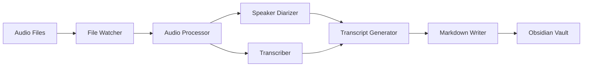

# Obsidian Scribe - Architecture Design

## Overview

Obsidian Scribe is a Python application designed to complement the Obsidian Whisper plugin by providing advanced audio processing capabilities. While Whisper handles recording, Obsidian Scribe adds speaker diarization, smart file chunking for large recordings, and enhanced Markdown formatting optimized for Obsidian.

### Complementary Workflow
- **Obsidian Whisper Plugin**: Records audio using VoiceMeeter mixed input
- **Obsidian Scribe**: Automatically processes recordings with advanced features

## Key Features

- 🎙️ **Automatic Audio Processing**: Monitors Audio folder for new .wav/.mp3 files
- 👥 **Speaker Diarization**: Identifies and separates different speakers using pyannote.audio
- 📝 **Transcription**: Converts speech to text using OpenAI-compatible Whisper API
- 📄 **Markdown Generation**: Creates Obsidian-optimized transcripts with YAML front matter
- 📁 **File Management**: Archives processed files to prevent reprocessing
- 🔪 **Smart Audio Splitting**: Handles files >25MB with intelligent chunking
- 🎙️ **VoiceMeeter Integration**: Documented setup for multi-source audio recording
- ⚙️ **Flexible Configuration**: YAML-based configuration with environment variable support
- 🛡️ **Robust Error Handling**: Comprehensive logging and automatic retry mechanisms

## Architecture Documents

This repository contains the complete architectural design for Obsidian Scribe:

1. **[ARCHITECTURE.md](ARCHITECTURE.md)** - Comprehensive system architecture including:
   - High-level component design
   - Component interactions and data flow
   - Detailed component descriptions
   - Error handling strategies
   - Security considerations
   - Performance optimizations

2. **[PROJECT_STRUCTURE.md](PROJECT_STRUCTURE.md)** - Detailed project organization including:
   - Complete directory layout
   - Module descriptions
   - File naming conventions
   - Key design patterns
   - Testing structure
   - Development workflow

3. **[TECHNICAL_DECISIONS.md](TECHNICAL_DECISIONS.md)** - Rationale for technology choices:
   - Library selection (pyannote.audio vs whisper-diarization)
   - API vs local model decisions
   - Architectural pattern choices
   - Performance trade-offs
   - Rejected alternatives

4. **[CONFIG_SCHEMA.md](CONFIG_SCHEMA.md)** - Complete configuration reference:
   - All configuration options
   - Environment variable overrides
   - Configuration profiles
   - Validation rules
   - Best practices

5. **[VOICEMEETER_SETUP.md](VOICEMEETER_SETUP.md)** - VoiceMeeter configuration guide:
   - Windows audio routing setup
   - Mixing microphone and Teams audio
   - Integration with Obsidian Whisper plugin
   - Troubleshooting tips

6. **[AUDIO_CHUNKING.md](AUDIO_CHUNKING.md)** - Audio chunking strategy:
   - Handling the 25MB API limit
   - Smart splitting with silence detection
   - Fallback strategies
   - Integration with diarization

7. **[WHISPER_INTEGRATION.md](WHISPER_INTEGRATION.md)** - Integration guide:
   - Configuring both tools to work together
   - Workflow scenarios
   - Best practices
   - Troubleshooting tips

## Quick Start Architecture Overview

### System Components



### Technology Stack

- **Language**: Python 3.8+
- **Speaker Diarization**: pyannote.audio
- **Transcription**: OpenAI Whisper API (custom endpoint)
- **File Monitoring**: watchdog
- **Audio Processing**: pydub
- **Configuration**: PyYAML
- **Logging**: Python logging with rotation

### Key Design Decisions

1. **Whisper API over Local Model**
   - Uses company-provided endpoint: `https://api.rdsec.trendmicro.com/prod/aiendpoint/v1/`
   - No GPU requirements
   - Consistent performance
   - 25MB file size limit handled via chunking

2. **pyannote.audio for Diarization**
   - Superior accuracy for 5+ speakers
   - Extensive configuration options
   - Active development and support
   - Essential for mixed audio streams from VoiceMeeter

3. **Event-Driven Architecture**
   - Real-time file processing
   - Decoupled components
   - Scalable design

4. **Audio Chunking Strategy**
   - Smart splitting at silence points
   - Fallback to time-based splitting
   - Maintains context with overlapping segments

### Output Format

Transcripts are generated in Obsidian-optimized Markdown:

```markdown
---
title: Meeting Recording - 2024-01-15
date: 2024-01-15
duration: 00:45:32
speakers:
  - Speaker 1
  - Speaker 2
  - Speaker 3
tags: [meeting, transcript, audio]
audio_file: "[[Audio/Meeting-2024-01-15.wav]]"
---

## 🗣 Speaker 1
[00:00:12] Welcome everyone to today's meeting.
[00:00:45] Let's start with the agenda.

## 🗣 Speaker 2
[00:01:10] Thanks for having me. I have some updates...
```

## Project Structure

```
obsidian-scribe/
├── src/
│   ├── config/         # Configuration management
│   ├── watcher/        # File system monitoring
│   ├── audio/          # Audio processing & transcription
│   ├── transcript/     # Transcript generation
│   ├── storage/        # File management
│   └── utils/          # Utilities and helpers
├── config/             # Configuration files
├── tests/              # Test suite
├── docs/               # Documentation
└── scripts/            # Utility scripts
```

## Configuration

Basic configuration example:

```yaml
obsidian_scribe:
  paths:
    audio_folder: "./Audio"
    transcript_folder: "./Transcripts"
    archive_folder: "./Audio/Archive"
  
  transcription:
    api_endpoint: "https://api.rdsec.trendmicro.com/prod/aiendpoint/v1/audio/transcriptions"
    model: "whisper-1"
    api_key_env: "OPENAI_API_KEY"
  
  diarization:
    max_speakers: 10
    min_segment_duration: 0.5
```

## Complete Recording & Processing Workflow

### 1. One-Time Setup
- **Install VoiceMeeter** - Mix multiple audio sources (see [VOICEMEETER_SETUP.md](VOICEMEETER_SETUP.md))
- **Configure Obsidian Whisper Plugin**:
  ```yaml
  Save recording: ON
  Recordings folder: "Audio/"
  Save transcription: OFF  # Let Obsidian Scribe handle this
  ```
- **Install & Configure Obsidian Scribe** - Monitor Audio folder

### 2. Recording Process
1. **Start VoiceMeeter** - Ensures audio mixing is active
2. **Use Obsidian Whisper Plugin** - Record meeting/conversation
3. **Audio saved to vault** - Whisper saves to Audio folder

### 3. Automatic Processing
Obsidian Scribe automatically:
- Detects new audio files
- Splits large files if >25MB
- Performs speaker diarization
- Transcribes via company Whisper API
- Generates enhanced Markdown
- Archives processed audio

### Why Use Both Tools?
- **Whisper Plugin**: Proven recording interface within Obsidian
- **Obsidian Scribe**: Adds capabilities Whisper doesn't have:
  - Multi-speaker identification
  - Large file handling
  - Enhanced formatting
  - Batch processing

## Next Steps

This architecture provides a solid foundation for implementing Obsidian Scribe. The design prioritizes:

- **Reliability**: Robust error handling and recovery
- **Performance**: Efficient processing with configurable concurrency
- **Usability**: Simple configuration and Obsidian integration
- **Compatibility**: Works with existing Obsidian Whisper plugin workflow
- **Extensibility**: Modular design for future enhancements

### Implementation Priorities

1. Core file watching and processing pipeline
2. Whisper API integration with custom endpoint
3. pyannote.audio diarization setup
4. Markdown generation with Obsidian formatting
5. Configuration management system
6. Error handling and logging
7. Testing suite
8. Documentation and examples

## License

This architectural design is provided as a reference for implementing Obsidian Scribe. The actual implementation should include appropriate licensing based on the dependencies used.

---

*This architecture was designed with a focus on reliability, performance, and seamless Obsidian integration. The modular design allows for easy testing, maintenance, and future enhancements.*