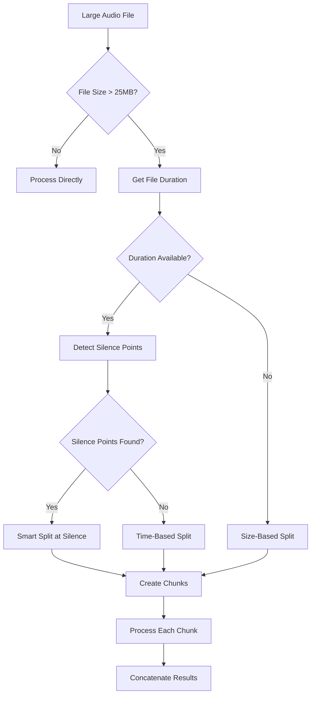

# Audio Chunking Strategy for Obsidian Scribe

## Overview

The Whisper API has a 25MB file size limit per request. This document outlines our strategy for handling large audio files, based on proven techniques from the media-transcriber project.

## Chunking Requirements

### File Size Constraints
- **API Limit**: 25MB (26,214,400 bytes) hard limit
- **Target Size**: 20-24MB per chunk (safety margin)
- **Optimal Duration**: 5-10 minutes per chunk for best accuracy

### Quality Considerations
- Avoid cutting in the middle of words or sentences
- Maintain context between chunks
- Preserve audio quality during splitting

## Implementation Strategy

### 1. Smart Splitting (Primary Method)

Uses silence detection to find natural break points:

```python
def detect_silence_points(file_path, min_silence_duration=2.0, silence_threshold='-50dB'):
    """Detect silence points in the audio file for smart splitting"""
    # Uses FFmpeg silencedetect filter
    # Returns timestamps of silence endings
```

**Advantages:**
- Natural breaks between sentences/paragraphs
- Better transcription accuracy
- Maintains semantic coherence

**Parameters:**
- `min_silence_duration`: 2.0 seconds (configurable)
- `silence_threshold`: -50dB (adjustable for different audio)

### 2. Time-Based Splitting (Fallback)

When silence detection fails or no suitable silence points exist:

```python
def calculate_optimal_split_points(duration, max_size_mb=24):
    """Calculate split points based on duration and size constraints"""
    max_duration_per_chunk = 600  # 10 minutes
    # Divides file into equal time segments
```

**Use Cases:**
- Continuous speech without pauses
- Music or non-speech audio
- Files with corrupted duration metadata

### 3. Size-Based Splitting (Emergency Fallback)

For files where duration cannot be determined:

```python
def split_by_size_only(input_file, output_dir, num_chunks):
    """Split file into equal parts when duration is unknown"""
    # Estimates duration based on file size and bitrate
    # Uses FFmpeg segment muxer
```

## Chunking Algorithm



## Chunk Processing

### 1. Overlap Strategy
- **Overlap Duration**: 2 seconds between chunks
- **Purpose**: Maintain context for better transcription
- **Implementation**: Adjust start/end times during splitting

### 2. Metadata Preservation
Each chunk maintains:
- Original file reference
- Chunk index and total count
- Start and end timestamps
- Duration information

### 3. Transcription Concatenation
```python
# Pseudo-code for combining chunk transcriptions
all_transcriptions = []
for chunk in chunks:
    transcript = transcribe(chunk)
    all_transcriptions.append({
        'chunk_index': chunk.index,
        'start_time': chunk.start_time,
        'text': transcript.text
    })
combined = merge_transcriptions(all_transcriptions)
```

## Configuration Options

```yaml
audio:
  chunking:
    enabled: true
    max_chunk_size_mb: 24
    target_chunk_duration: 600  # 10 minutes
    
    # Smart splitting options
    smart_split:
      enabled: true
      min_silence_duration: 2.0
      silence_threshold: "-50dB"
      tolerance_seconds: 30  # Look for silence within this range
    
    # Overlap options
    overlap:
      enabled: true
      duration_seconds: 2
    
    # Fallback options
    fallback:
      estimated_bitrate_kbps: 128
      min_chunk_duration: 300  # 5 minutes
```

## Error Handling

### Common Issues and Solutions

1. **FFprobe Duration Detection Failure**
   - Try alternative detection methods
   - Fall back to size-based estimation
   - Log warning and continue

2. **No Suitable Split Points**
   - Use time-based splitting
   - Ensure minimum chunk duration (5 minutes)
   - Maximum chunk duration (10 minutes)

3. **Chunk Creation Failure**
   - Retry with different parameters
   - Skip problematic segments
   - Log detailed error information

## Performance Optimization

### 1. Parallel Chunk Processing
```python
# Process multiple chunks concurrently
with ThreadPoolExecutor(max_workers=4) as executor:
    futures = [executor.submit(transcribe_chunk, chunk) for chunk in chunks]
    results = [f.result() for f in futures]
```

### 2. Streaming for Large Files
- Use FFmpeg streaming capabilities
- Avoid loading entire file into memory
- Process chunks as they're created

### 3. Caching Strategy
- Cache chunk boundaries for reprocessing
- Store intermediate results
- Enable resume on failure

## Integration with Diarization

### Challenge: Speaker Continuity
When splitting files, speaker identification must be maintained across chunks.

### Solution: Speaker Embedding Overlap
1. Include extra audio at chunk boundaries for speaker embedding
2. Use speaker embeddings from previous chunks
3. Post-process to merge speaker labels

```python
def maintain_speaker_continuity(chunks, diarization_results):
    """Ensure consistent speaker labels across chunks"""
    speaker_mapping = {}
    for i, chunk_result in enumerate(diarization_results):
        if i > 0:
            # Compare embeddings with previous chunk
            map_speakers(chunk_result, diarization_results[i-1], speaker_mapping)
```

## Testing Considerations

### Test Cases
1. **Small Files** (< 25MB): Should not be chunked
2. **Medium Files** (25-100MB): 2-4 chunks expected
3. **Large Files** (> 100MB): Verify all chunks < 25MB
4. **Edge Cases**:
   - Files exactly 25MB
   - Very short files with high bitrate
   - Files with no silence
   - Corrupted duration metadata

### Validation
- Verify no data loss during splitting
- Check chunk boundaries for word integrity
- Ensure total duration matches original
- Validate concatenated transcription completeness

## Future Enhancements

1. **Adaptive Chunking**
   - Analyze audio characteristics
   - Adjust parameters dynamically
   - Learn from transcription quality

2. **Intelligent Overlap**
   - Detect sentence boundaries
   - Variable overlap based on content
   - Minimize redundant processing

3. **Progressive Processing**
   - Start transcription while chunking
   - Stream results to user
   - Real-time progress updates

This chunking strategy ensures reliable processing of large audio files while maintaining transcription quality and system performance.